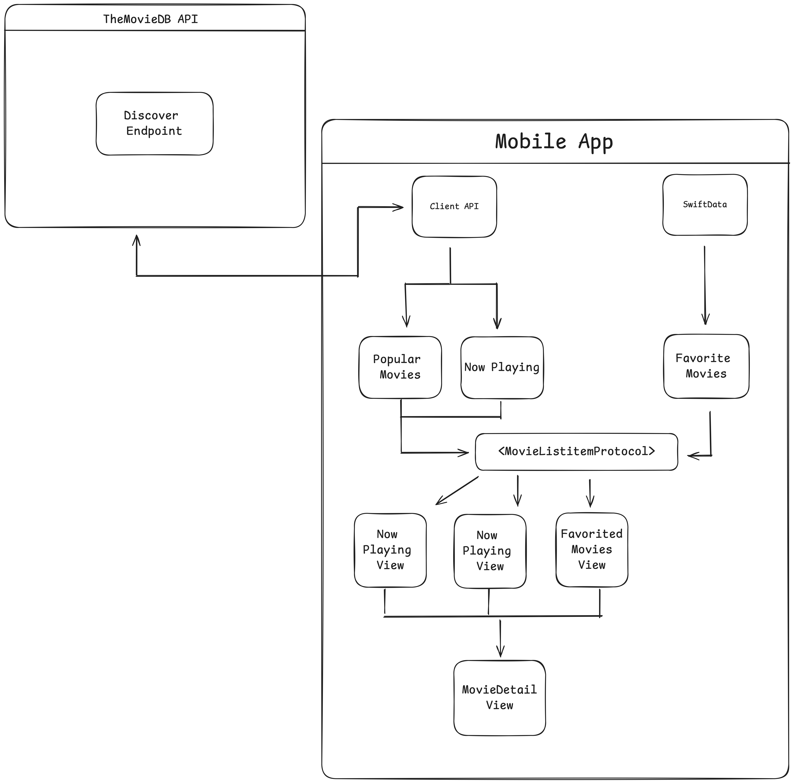

# CineStore

iOS Application using The Movie DB API to populate content

<p align="center">
  
</p>

## Arquitecture

- **Clean Arquitecture**
- **SOLID principles**
- **MVVM**

## Stack
- **Swift**
- **SwiftUI**
- **Combine**
- **SwiftData**
- **SPM**

## Usage

1. **Clone the Repository**:

    ```bash
    git clone git@github.com:memoherrera/CineStore.git
    cd BaseSwiftUI
    ```
2. **Open Xcode** 

    Open Xcode project:

    ```bash
    open CineStoreApp.xcodeproj
    ```
    
3. **Build and Run**:

    Build and run the project in Xcode.

## Project Folder Organization

- **Presentation**: Views, navigation, view-models.
- **Domain**: Use cases (Business logic).
- **Data**: Repos and Data Sources


## Third Party Packages

1. [LinkNavigator](https://github.com/interactord/LinkNavigator.git): discconect navigation logic form the view 
4. [Kingfisher](https://github.com/onevcat/Kingfisher.git): remote images
