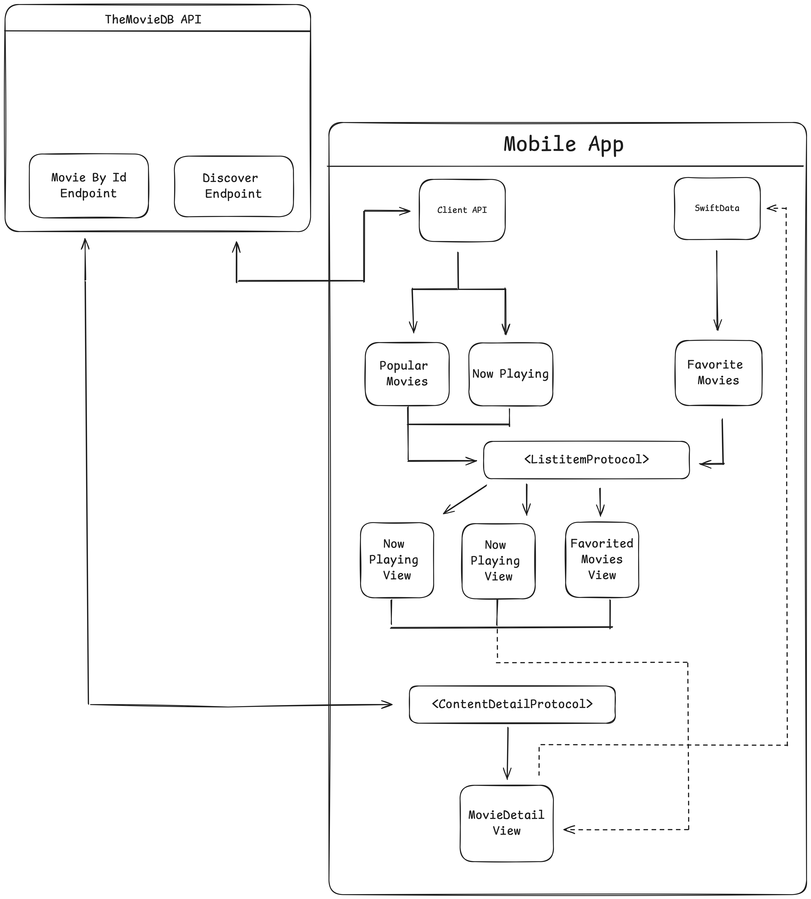

# CineStore

iOS Application using The Movie DB API to populate content

<p align="center">
  
</p>

## Arquitecture

- **Clean Arquitecture**
    A design approach that emphasizes separation of concerns, making your codebase easier to maintain, test, and scale.
- **SOLID principles**
    A set of five guidelines that help you write more understandable, flexible, and maintainable code by promoting good object-oriented design.
- **MVVM**
    A design pattern that separates the UI logic from the business logic, making your code more modular and testable, especially in UI-centric applications.

## Stack
- **Swift**
- **SwiftUI**
- **Combine**
- **SwiftData**
- **SPM**

## Usage

1. **Clone the Repository**:

    ```bash
    git clone git@github.com:memoherrera/CineStore.git
    cd CineStore
    ```
2. **Open Xcode** 

    Open Xcode project:

    ```bash
    open CineStoreApp.xcodeproj
    ```
4. **API Secret**:
    
    Go to target Build Settings > User Defined > SECRET_KEY and paste the value provided by the Author 
    
4. **Build and Run**:
    
    Build and run the project in Xcode. 

## Project Folder Organization

  **Main Folders**:
    
- **Presentation**: Views, navigation, view-models.
- **Domain**: Use cases (Business logic).
- **Data**: Repos and Data Sources


## Third Party Packages

1. [Alamofire](https://alamofire.github.io/Alamofire): Networking
2. [CCommonCrypto](https://github.com/jernejstrasner/CCommonCrypto.git): Added security to private values
3. [Factory](https://github.com/hmlongco/Factory): discconect navigation logic form the view 
4. [Kingfisher](https://github.com/onevcat/Kingfisher.git): remote images
5. [LinkNavigator](https://github.com/interactord/LinkNavigator.git): discconect navigation logic form the view 
6. [Then](https://github.com/devxoul/Then): Utility
